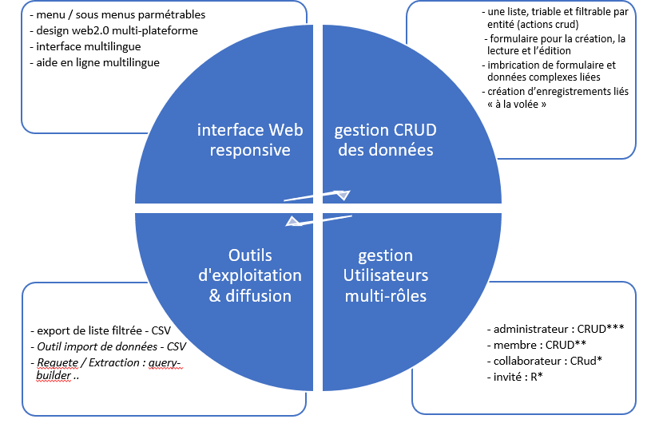

InBORe 1.0 : Interface de Base de données Orientée Recherche v1.0 --- Licence :  GPL-v3

# InBORe ?

Squelette d’interface de gestion CRUD de bases de données relationnelles. Ce projet intègre une compilation de développements et modules réutilisables pour faciliter la création et la maintenance d’interface web de gestion de bases de données. Il est basé sur des choix technologiques libre et open source (Symfony, PHP, webPack, bootstrap)

# Documentation

[installation et développement](./docs/InBORe_documentation.docx)

